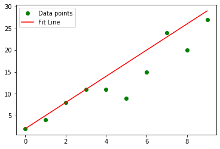
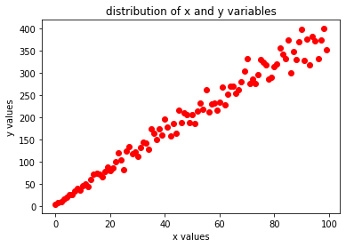

# Fitting a curve using the method of Least Square


## Method of Least squares

* It is a statistical method to fit a curve to a distribution of point in and N-Dimensional space.

* We shall consider a simple 2 D distribution of X-Y and try to fit a linear line to a set of points in the distributions

* We shall also go through the mathematical derivation for extracting the fitting coefficients for the method of least squares

* Consider the distribution below (green), We need to fit the line (red) to the distribution. In short we shall see how to best choose the line parameters (slope and intercept) for the given distribution


```python
import matplotlib.pyplot as plt
import numpy as np
import math 
import random as rand

x = np.arange(0,10)
y = 3*x + 2
for i in range(len(y)):
    y[i] = y[i] + rand.gauss(0,y[i]/5)
plt.plot(x, y, 'go', label = "Data points")
plt.plot(x, 3*x + 2, 'r', label = "Fit Line")
plt.legend()
```


    <matplotlib.legend.Legend at 0x7f330fa79690>





## Derivation of coefficients

From the graph above and the table below we have the distribution of data as following

| X | Y  |
|---|----|
| 0 | 2  |
| 1 | 4  |
| 2 | 8  |
| 3 | 11 |
| 4 | 11 |
| 5 | 9  |
| 6 | 15 |
| 7 | 24 |
| 8 | 20 |
| 9 | 27 |

Our task is to fit a straight line to the given set of numbers. Let us assume that the fitted line is of the form 

$$y(x) = mx + c$$

* This means that in an ideal case when we plug in the x values in the left side of the equation, the equation must return the corresponding observed 'y' values. 

* Unfortunately, we do not have an ideal case every time we plug in the x value in the equation out comes a value that does not exactly match the 'y'. However, we can indeed play with the 'm' and the 'c' value such that the equatioon closely outputs the value of 'y'.

* As the name suggests let us fist try to find the residue for each and a given data point

$$ d_i^2 = (Y_i - y(X_i))^2 $$

* for instance, for the first data point (0,2)
    $$d_0^2 = (2 - (m*0 +c))^2$$

* The sum of all such residues are

$$\Sigma_i^N d_i^2 = \Sigma_i^N (Y_i - mX_i - c)^2$$

Where N is the total number of samples. 

* The goal of this algorithm is to minimise this metric $\Sigma d_i^2$. and the way to do it is to vary the 'm' and 'c' such that it attains a minimum,

* From differentials we know that this means the derivative of this quantity $\Sigma d_i^2$ must be equal to 0 and the second derivative has to be positive so that the $\Sigma d_i^2$ is minimum

* On differentiation of the previous equation with respect to 'm' we have

    $$\frac{\partial [ \sum_{i}^{N} d_i^2 ]}{\partial m} = \frac{\partial [\Sigma_i^N (Y_i - mX_i - c)^2]}{\partial m}$$
    $$\frac{\partial [ \sum_{i}^{N} d_i^2 ]}{\partial m} = \sum_{i}^{N} 2 (Y_i - mX_i - c) \frac{\partial (Y_i - mX_i - c)}{\partial m}$$
    $$\frac{\partial [ \sum_{i}^{N} d_i^2 ]}{\partial m} = \sum_{i}^{N} 2 (Y_i - mX_i - c) \frac{\partial (-mX_i)}{\partial m}$$
    $$\frac{\partial [ \sum_{i}^{N} d_i^2 ]}{\partial m} = \sum_{i}^{N} 2 (Y_i - mX_i - c) (-X_i)$$
* For the $\Sigma d_i^2$ to be minimum the L.H.S of the above equation has to be zero

    $$0 =\sum_{i}^{N} 2 (Y_i X_i - mX_i^2 - cX_i) $$
    $$0 = 2 (\sum_{i}^{N}Y_i X_i - \sum_{i}^{N}mX_i^2 - \sum_{i}^{N}cX_i) $$
    
* Similarly we can now look into the variation of $\Sigma d_i^2$ with respect to the constant c. Similar steps as before will yield
    $$\frac{\partial [ \sum_{i}^{N} d_i^2 ]}{\partial c} = \frac{\partial [\Sigma_i^N (Y_i - mX_i - c)^2]}{\partial c}$$
    $$0 = \frac{\partial [\Sigma_i^N (Y_i - mX_i - c)^2]}{\partial c}$$
    $$0 = \sum_{i}^{N} 2 (Y_i - mX_i - c) \frac{\partial (Y_i - mX_i - c)}{\partial c}$$
    $$0 = \sum_{i}^{N} 2 (Y_i - mX_i - c) (-1)$$
    $$0 = \sum_{i}^{N} 2 (Y_i - mX_i - c)$$
    $$0 = 2 (\sum_{i}^{N} Y_i - \sum_{i}^{N} mX_i - Nc)$$
    
* Now, equation 10, 16 can be solved in equation in 2 variables that is in m and c. When solved we get the following

$$m = \frac{N \sum_{i}^{N} X_i Y_i - \sum_{i}^{N} X_i \sum_{i}^{N} Y_i}{N \sum_{i}^{N} X_i^2 - (\sum_{i}^{N} X_i)^2}$$

$$c = \frac{\sum_{i}^{N} Y_i \sum_{i}^{N} X_i^2 - \sum_{i}^{N} X_i \sum_{i}^{N} X_i Y_i}{N \sum_{i}^{N} X_i^2 - (\sum_{i}^{N} X_i)^2}$$


Finally we have the slopes and intercept for the best least square error line to the distribution we have. Therefore, the fitting is basically to calculate the 'm' and 'c' and then drawing the line which best represents the distribution. 

### Question 1

Given a set of variable x and y, write a function in python to calculate the fitting coefficients for the distribution. 

You can design the function a few functions are follows.

* Write a function which takes in 2 arguments which are an array or a list of numbers and returns the sum of the product of the 2 arrays. For eg. you can define the function as <code> SigmaXY(array X, array Y) </code> which will multiply each and every element in X with its corresponding element in Y and return the sum of this products.


* Write a function which takes in 1 argument which is an array or a list of numbers and returns the sum of the arry or the list of numbers. For eg. you can define the function as <code> SigmaX(array X) </code> which will return the sum of all the numbers in the list

Using these functions fit the distribution with straight line

The variables x and y are given below in the code cell.

### Question 2 

A food for thought using the method outline above can you derive the formula for fitting coefficients for a distribution varying in 2nd order polynomial i.e it is of the form $m_1 x^2 + m_2 x + m_3 = y$. Calculate the formula for $m_1$ $m_2$ and $m_3$.


```python
import numpy as np
import random as rand
import matplotlib.pyplot as plt

x = np.arange(0,100) # creating 1000 random numbers
y = 2*x + 2 # creating the dependent variable x 
for i in range(len(y)):
    y[i] += rand.gauss(y[i],y[i]/5) # adding some noise to y data
plt.plot(x,y,'ro')
plt.xlabel("x values")
plt.ylabel("y values")
plt.title("distribution of x and y variables")
```


    Text(0.5, 1.0, 'distribution of x and y variables')





```python

```
